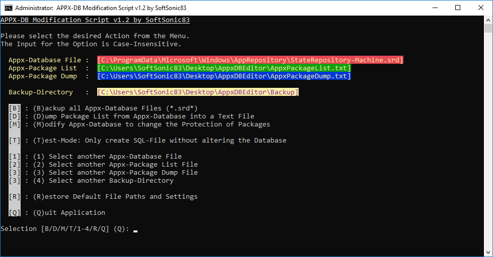

<h1>
	
	AppxDBEditor by SoftSonic83
</h1>

<h2>Version: 1.2 (Initial Import)</h2>

<h4><ins>PURPOSE:</ins></h4>

	This Script automates all the necessary Steps, needed to change the
	Protection State of preinstalled System Apps in Windows 10, so that they
	can be removed afterwards by either PowerShell or Modern Settings Dialog.

<h4><ins>FUNCTIONAL DESCRIPTION:</ins></h4>

	The Script modifies the Appx-Database of Windows 10 to change the Protection
	States of preinstalled System-Apps so that they can be uninstalled. The Appx-
	Database ("StateRepository-Machine.srd") of Windows 10 contains Information
	about all installed Appx-Packages and controls their Distribution to the Users.
	Some of those preinstalled System-Apps like the Store ("MicrosoftStore") or the
	"Content Delivery Manager" being responsible for lots of Ads, Telemetry-Data and
	self-installing Apps, cannot be uninstalled via Modern Settings Dialog or
	PowerShell. This is because all these Packages are protected from Uninstallation
	by a special Flag ("IsInbox") within the "Package" Table of the Appx-DB. This
	SQLite-Table lists all installed Appx-Packages. The Column named "IsInbox"
	defines the Protection State for each Package by containing either a Value of 1
	which means that the Package is a "Part Of The Box" and therefore it cannot be
	uninstalled or a Value of 0 indicating that the Appx-Package can be uninstalled
	for all Users.

	By Modifying the "IsInbox"-Value of an Appx-Package to 0 the Protection of the
	Package will be disabled and can be therefore uninstalled by Settings Dialog or
	PowerShell. A Config File defines how the Protection State of the listed Packages
	is modified by the Script. It's sufficient to only specify a Part of the Package
	Name. Thereby the File will stay compatible among further Version Builds of Windows
	10.

	Until now it was easily possible to manually edit the IsInbox Values by	Using a
	graphical Editor like SQLite Database Browser. Since the newest	Build of Windows
	10 (1809), you will get an Error Message saying "no such function: workid", when
	using such Editors. This is because the StateRepository Database now contains
	Trigger Functions, which will get triggered to execute if specific Values are
	modified within the "Package" Table. These Functions cannot execute when the
	Database is opened in the Editor and so the above Error is thrown. To bypass this
	Problem all Triggers have to be safed and temporarily removed from the Database
	first before Editing any IsInbox Values. After applying the SQL-Statements to
	Update the IsInbox Values all Triggers are beeing recreated by this Script.

<h4><ins>NOTICE:</ins></h4>

	By Removing any preinstalled and protected System-Apps you may no longer get any
	Feature-Updates	for your Windows 10 Installation in the Future.

<h4><ins>SCRIPT FEATURES:</ins></h4>

        This Menu- and Dialog-Driven Batch-Script operates based on a Configuration File
        in which you can specify the Names of the Packages and their respective Protection
        States that have to be set by the Script. The Script provides the following features:
	 
	<h4>&nbsp;&nbsp;&nbsp;&nbsp;Core Script Features:</h4>

<ul type="disc">
	<li>
		Menu- and Dialog-Driven User Interaction with Error-Handling
	</li>
	<li>
		Automated Request for Admin Rights so "Run-As-Admin" isn't needed
	</li>
	<li>
		Script can be run from any Folder or Network Path if you have corresponding Rights
	</li>
	<li>
		Support for Paths including Spaces
	</li>
	<li>
		The Ability to manipulate the Appx-Database File protected by the SYSTEM User
		directly without changing Owner or any ACLs by running the Commands in the SYSTEM
		Users Context
	</li>
	<li>
		A Config File including the Packages to be modified with Support for Comments (#)
	</li>
	<li>
		Partial Package Names can be used in the Config File to address similar	Packages
		at once and to keep the File independend of Package Versions
	</li>
	<li>
		A Backup of the Appx-Database is created before making any Changes
	</li>
	<li>
		Automatic Result Verification by Checking the new States against the Config File
	</li>
	<li>
		The generated SQL-Script is placed in the Working Directory afterwards for later
		Inspection
	</li>
</ul>

        <h4>&nbsp;&nbsp;&nbsp;&nbsp;Functional Features:</h4>

<ul type="disc">
	<li>
		An Option to automatically modify the Appx-Database based on the Config
		File
	</li>
	<li>
		An Option to manually create a Backup of the Appx-Database Files
	</li>
	<li>
		An Option to export a Dump of all Packages in the Database and their
		Protection State
	</li>
	<li>
		A Test Mode that only generates the SQL-Files without making any
		Changes to the Database
	</li>
	<li>
		An Option to select another Appx-Database File
	</li>
	<li>
		An Option to select another Appx-Package List File
	</li>
	<li>
		An Option to select another Appx-Package Dump File
	</li>
	<li>
		An Option to select another Backup-Directory Path
	</li>
	<li>
		An Option to restore Default Paths and Settings
	</li>
</ul>

<h4><ins>SCREENSHOT:</ins></h4>

	

<h4><ins>ADDENDUM:</ins></h4>

	By now the Script has reached Final Version 1.2 and has been successfully tested
	on Version 1809 and 1803 of Windows. Since Microsoft continually changes Names of
	the Packages and whether they are stored as Appx-Package in the Appx-Database or
	as Classic Desktop Package within the Component Based Store (CBS), the Name(s) and
	Presence of certain Packages may vary among different Windows Builds.

	In the Beginning this Script was just made for personal Usage. But then I found this
	Post <ins><a href="https://social.technet.microsoft.com/Forums/lync/en-US/
	a05cb12a-e0f7-4330-86ae-abca1ffb5629/ltsc-2019-sysprp-failed-to-remove-apps-for-the-current-
	user-0x80073cf2?forum=win10itprogeneral"
	title="LTSC 2019 SYSPRP Failed to remove apps for the current user: 0x80073cf2"
	rel="nofollow">LTSC 2019 SYSPRP Failed to remove apps for the current user: 0x80073cf2</a></ins>
	where other People also have discussed the Issue of Removing protected System Apps.
	So I decided to share it with the Community. If you have any Comments or Suggestions,
	please let me know.

<h4><ins>CONTACT INFORMATION:</ins></h4>

	E-Mail: <ins><a href="mailto:SoftSonic83@web.de?subject=AppxDBEditor Contact Inquiry">SoftSonic83@web.de</a></ins>

<h4><ins>DISCLAIMER &amp; COPYRIGHT:</ins></h4>

	THIS SOFTWARE IS PROVIDED "AS IS", WITHOUT WARRANTY OF ANY KIND, EXPRESS OR
	IMPLIED, INCLUDING BUT NOT LIMITED TO THE WARRANTIES OF MERCHANTABILITY,
	FITNESS FOR A PARTICULAR PURPOSE AND NONINFRINGEMENT. IN NO EVENT SHALL THE
	AUTHOR OR COPYRIGHT HOLDERS BE LIABLE FOR ANY CLAIM, DAMAGES OR OTHER
	LIABILITY WHETHER IN AN ACTION OF CONTRACT, TORT OR OTHERWISE, ARISING FROM
	OUT OF OR IN CONNECTION WITH THE SOFTWARE OR THE USE OR OTHER DEALINGS IN
	THE SOFTWARE.

<b>COPYRIGHT © 2019 by SoftSonic83</b>